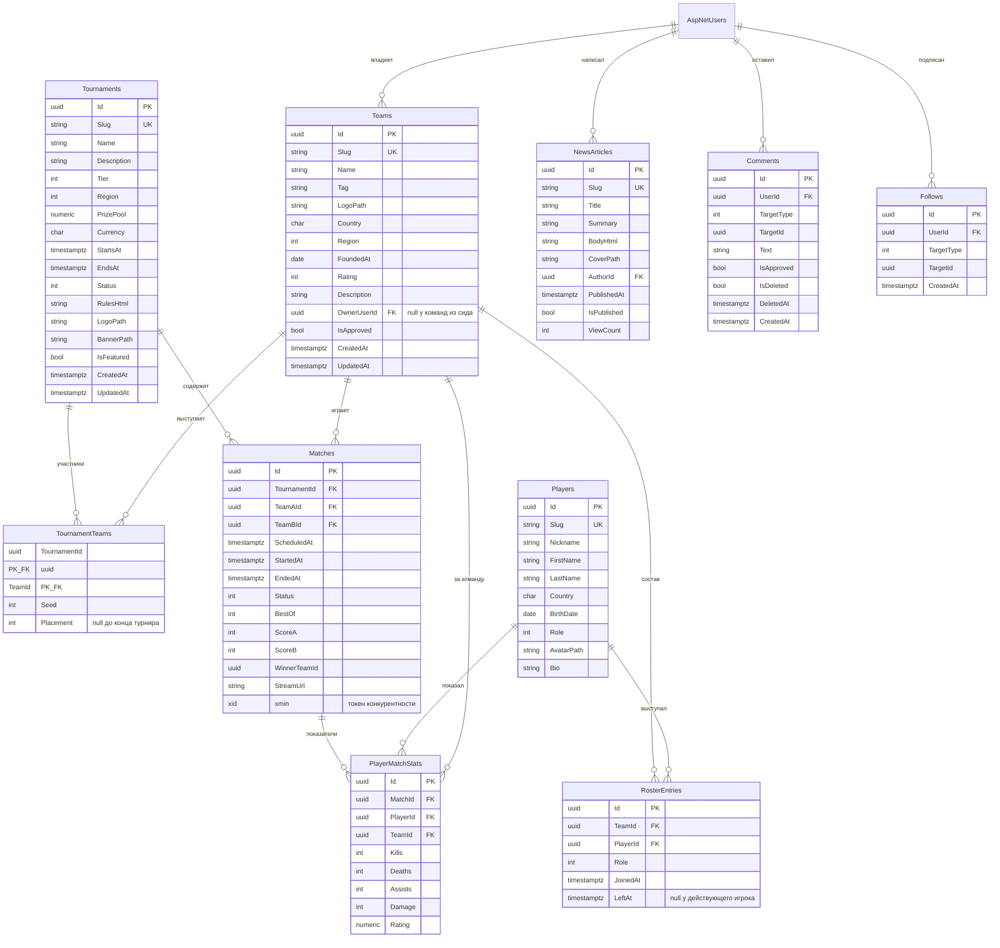
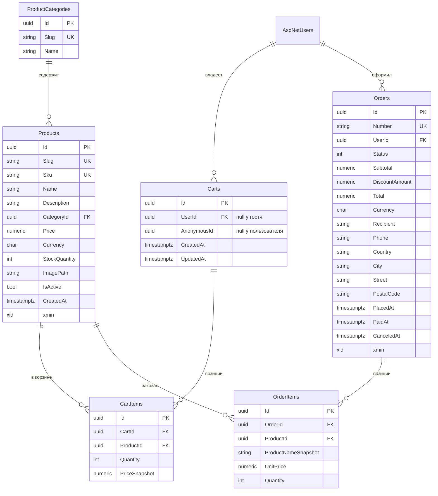
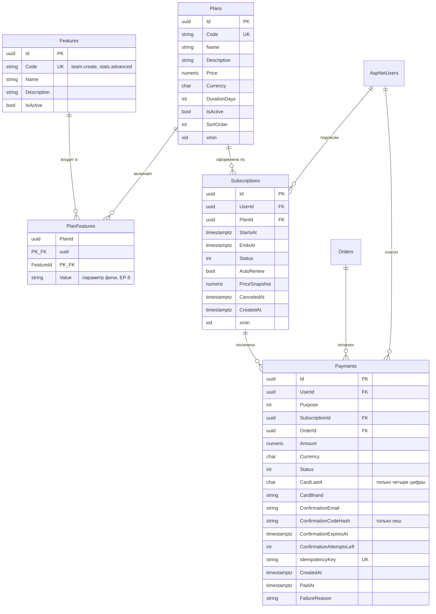
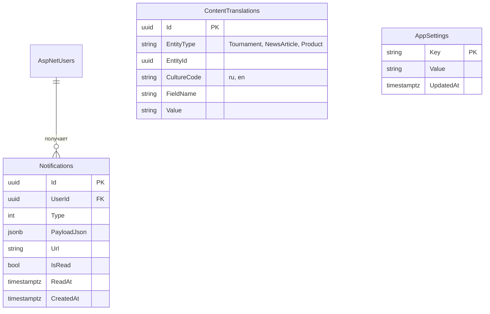

# Модель данных ZeldaArena

Схема PostgreSQL после миграции `InitialCreate` (Фаза 1). Источник требований —
`docs/SPEC.md` §6, принятые технические решения — `docs/adr/ADR-0003-data-model.md`.

**31 таблица:** 7 Identity, 10 киберспортивных, 6 магазина, 5 биллинга, 3 общих.
`docs/SPEC.md` §6 перечисляет 30; таблица `Notifications` добавлена, потому что §5.3
объявляет сущность `Notification`, а §11 требует колокольчик со счётчиком непрочитанных,
переживающий перезагрузку страницы.

## Соглашения

| Что | Как |
|---|---|
| Первичные ключи | `uuid`, генерация Guid v7 в конструкторе сущности |
| Деньги | `numeric(18,2)`; валюта — отдельный столбец `Currency`, `char(3)` |
| Даты и время | `timestamptz` (`DateTimeOffset`), хранение в UTC |
| Даты без времени | `date` (`DateOnly`) — дата рождения, дата основания команды |
| Конкурентность | системный столбец `xmin`, объявлен теневым свойством; столбца `RowVersion` в сущностях нет |
| Мягкое удаление | `IsDeleted` + глобальный query filter, только у `Comments` |
| Слаг | строка до 128 символов, уникальный индекс |

Связи с `AspNetUsers` объявлены только в конфигурациях `Infrastructure`: доменные сущности
хранят `Guid UserId` и о таблице пользователей не знают.

## Киберспорт

`RosterEntries.IsActive` в базе **не хранится**: признак выводится из `LeftAt IS NULL`.
Отдельный столбец дублировал бы данные и мог бы с ними разойтись.

`Comments.TargetId` и `Follows.TargetId` — полиморфные ссылки без внешнего ключа: цель
задаётся парой `TargetType` + `TargetId`. Это осознанный компромисс, иначе понадобились бы
отдельные таблицы комментариев для новостей и матчей.

## Магазин

Шесть столбцов адреса в `Orders` — объект-значение `ShippingAddress`, разложенный
`ComplexProperty`. Адрес и цены хранятся снапшотами: заказ обязан выглядеть одинаково
и через год, даже если товар переименовали, а профиль пользователя изменили.

Магазин работает в одной валюте, поэтому у `CartItems` и `OrderItems` столбца валюты нет —
она берётся у заказа.

## Подписки и оплата

Столбцов под полный номер карты и CVV в схеме **нет и не будет** — `docs/SPEC.md` §7.6.
Код подтверждения хранится только хешем.

`PlanFeatures` — точка расширяемости EP-4: фича снимается с тарифа и переносится
в отдельный тариф записями в этой таблице, без деплоя.

## Общее

`ContentTranslations` уникальна по четвёрке `(EntityType, EntityId, CultureCode, FieldName)`.
Суррогатный `Id` в ограничение не входит: он уникален сам по себе и в нём бесполезен.

`Notifications.PayloadJson` хранит подстановки, а не готовый текст: перевод собирается
на клиенте по типу уведомления и текущей культуре.

## Identity

Семь стандартных таблиц ASP.NET Core Identity: `AspNetUsers`, `AspNetRoles`,
`AspNetUserRoles`, `AspNetUserClaims`, `AspNetRoleClaims`, `AspNetUserLogins`,
`AspNetUserTokens`. `AspNetUsers` расширен полями `DisplayName`, `AvatarPath`,
`PreferredCulture`, `CountryCode`, `CreatedAt`, `LastLoginAt`, `IsBlocked`.

## Правила удаления

| Связь | Поведение | Почему |
|---|---|---|
| `Matches` → `Tournaments`, `Teams` | `Restrict` | история матчей не стирается каскадом |
| `TournamentTeams` → `Teams` | `Restrict` | то же |
| `Orders`, `Payments`, `Subscriptions` → `AspNetUsers` | `Restrict` | финансовая история не удаляется вместе с пользователем |
| `NewsArticles` → `AspNetUsers` | `Restrict` | удаление автора не уносит новости портала |
| `OrderItems` → `Products` | `Restrict` | снятый с продажи товар не ломает старые заказы |
| `Teams.OwnerUserId` → `AspNetUsers` | `SetNull` | команда остаётся, но становится ничьей |
| `Payments.SubscriptionId` / `OrderId` | `SetNull` | платёж остаётся в истории |
| `Comments`, `Follows`, `Notifications`, `Carts` → `AspNetUsers` | `Cascade` | личные данные уходят вместе с пользователем |
| `CartItems` → `Carts`, `OrderItems` → `Orders` | `Cascade` | позиции не существуют без родителя |

## Индексы под фильтры

Уникальные: `Slug` у турниров, команд, игроков, новостей, товаров и категорий;
`Code` у тарифов и фич; `Sku` у товаров; `Number` у заказов; `IdempotencyKey` у платежей;
`(UserId, TargetType, TargetId)` у подписок на команды; `(MatchId, PlayerId)` у статистики;
`(CartId, ProductId)` у позиций корзины; частичные уникальные на `Carts.UserId`
и `Carts.AnonymousId`.

Составные под фильтрацию `docs/SPEC.md` §10.2: `Matches(TournamentId, Status, ScheduledAt)`,
`Matches(Status, ScheduledAt)`, `Tournaments(Status, StartsAt)`, `Tournaments(Region, Status)`,
`Teams(Region, Rating)`, `Products(CategoryId, IsActive)`, `Orders(UserId, Status, PlacedAt)`,
`Subscriptions(UserId, Status)`, `Subscriptions(EndsAt)`,
`Notifications(UserId, IsRead, CreatedAt)`.

## Состав сида

Заполняется при старте в среде Development, идемпотентно.

| Набор | Количество |
|---|---|
| Тарифы / фичи / привязки | 3 / 2 / 4 |
| Категории / товары | 3 / 24 |
| Команды / игроки / записи состава | 12 / 60 / 60 |
| Турниры / участники | 4 (1 прошёл, 1 идёт, 2 предстоящих) / 24 |
| Матчи | 40: 16 Scheduled, 2 Live, 20 Finished, 1 Postponed, 1 Canceled |
| Статистика игроков | 200 |

Пользователей, ролей, администратора, новостей, подписок и заказов в сиде Фазы 1 нет:
им нужны `UserManager` и `RoleManager`, появляющиеся в Фазе 3. Сидер там расширяется,
а не переписывается.
